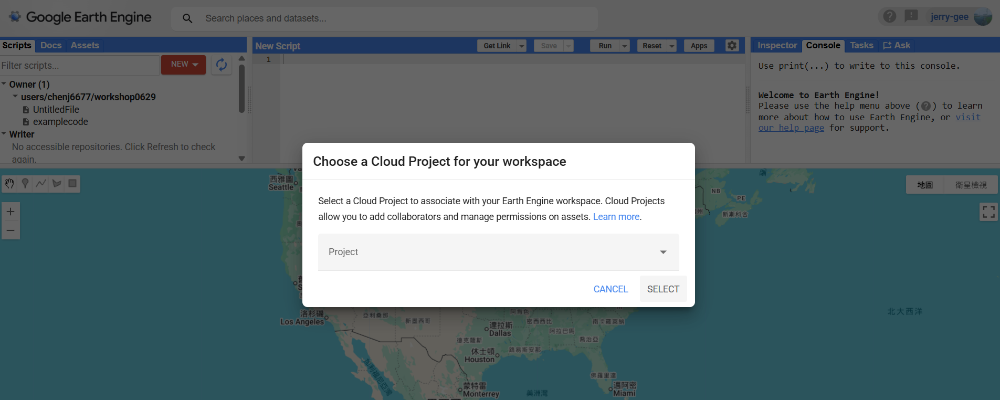
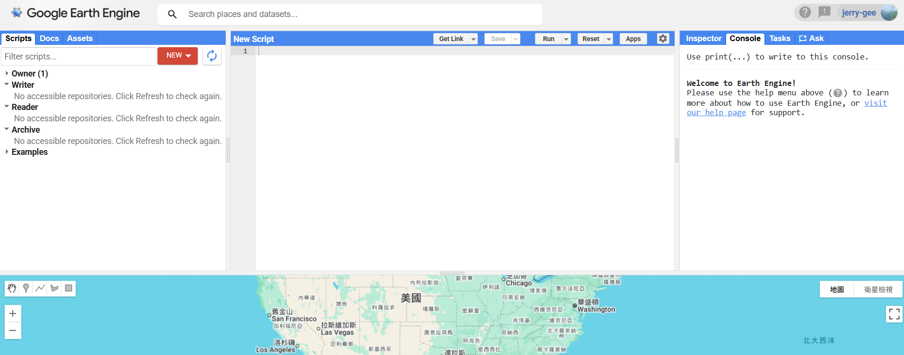
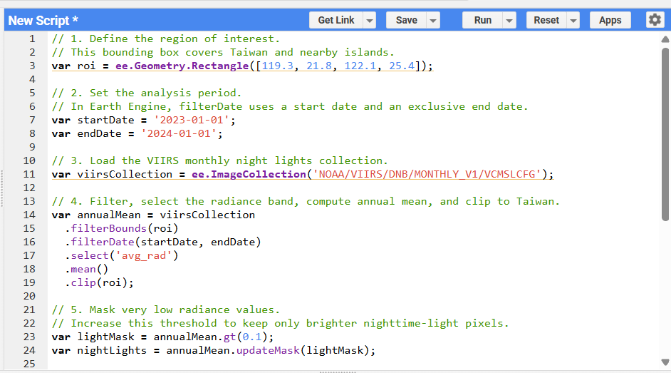
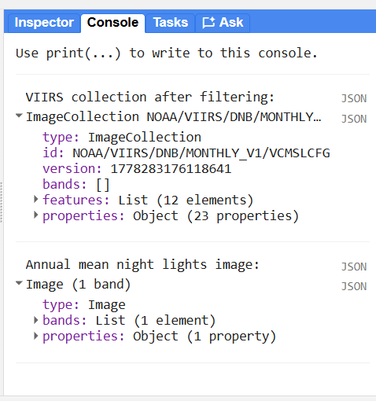
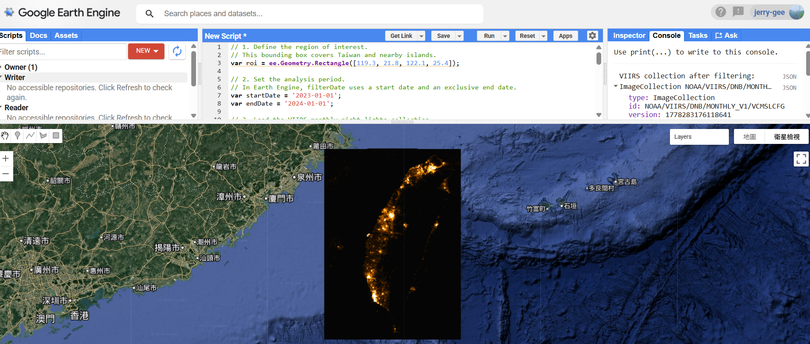

# GEE Code Editor 教學：台灣 VIIRS 夜間燈光

這份教學示範如何在 Google Earth Engine 官方 Code Editor 平台，用
JavaScript 重現 notebook 中的 VIIRS 夜間燈光範例。

範例程式碼：

```text
01_viirs_night_lights_taiwan.js
```

本範例會讀取 2023 年的 VIIRS monthly night lights 資料，計算台灣區域的年度平均夜間燈光，並在地圖上顯示結果。

## 1. 開啟 GEE Code Editor

進入 Google Earth Engine Code Editor：

```text
https://code.earthengine.google.com/b7e3a1999822da32ab31169fb049dc20
```

請使用已啟用 Earth Engine 權限的 Google 帳號登入。

如果是第一次使用，可能會看到 Google Earth Engine 的歡迎畫面。一般教學或非商業用途可依照帳號狀態選擇註冊新專案，或選擇已授權的 Cloud Project。


第一次進入或切換 workspace 時，系統可能會要求選擇 Cloud Project。選擇你要綁定的專案後，按下 `SELECT`。



## 2. 認識 Code Editor 介面

進入 Code Editor 後，畫面主要分成四個區域：

1. 左側 `Scripts / Docs / Assets`：管理 script、查文件、查看 assets。
2. 中間上方程式碼區：貼上或撰寫 JavaScript。
3. 右側 `Inspector / Console / Tasks`：查看點位資訊、print 輸出、匯出任務。
4. 下方地圖區：顯示分析結果和圖層。



## 3. 最簡化方法：直接開啟範例 Script

如果只是要最快開始使用，可以直接打開以下連結：

```text
https://code.earthengine.google.com/b7e3a1999822da32ab31169fb049dc20
```

或直接點這裡：

[開啟 GEE 範例 script](https://code.earthengine.google.com/b7e3a1999822da32ab31169fb049dc20)

進入頁面後，會直接開啟範例 script。確認程式碼載入後，按上方 `Run` 即可執行。

如果這個連結無法使用，或想手動練習 Code Editor 操作，再依照下一步建立新 script 並貼上程式碼。

## 4. 建立新 Script

在左側 `Scripts` 區域按 `NEW`，建立一個新的 script。可以命名為：

```text
viirs_night_lights_taiwan
```

如果只是快速測試，也可以直接使用畫面中的 `New Script` 編輯區。

## 5. 貼上 JavaScript 程式碼

打開本資料夾中的：

```text
01_viirs_night_lights_taiwan.js
```

複製全部內容，貼到 Code Editor 中間的程式碼區。



## 6. 執行程式

按上方工具列的 `Run`。

程式會執行以下流程：

1. 定義台灣的研究範圍 `roi`。
2. 載入 VIIRS monthly night lights 影像集合。
3. 篩選 2023 年資料。
4. 選擇 `avg_rad` 夜間燈光亮度波段。
5. 計算年度平均影像。
6. 過濾低亮度像素。
7. 將結果加入地圖。
8. 在 Console 印出資料資訊。

## 7. 查看 Console 輸出

執行後，右側切到 `Console`。你應該會看到兩個輸出：

- `VIIRS collection after filtering`：篩選後的 VIIRS ImageCollection。
- `Annual mean night lights image`：年度平均後的單張影像。

這可以用來確認資料集、時間範圍和波段是否正確。



## 8. 查看地圖結果

地圖會自動移動到台灣附近，並顯示 2023 年平均夜間燈光。

顏色越亮，代表夜間燈光強度越高。通常可以看到西部都會區、主要城市、港口和交通廊帶比較明顯。



## 9. 調整分析年份

如果要分析其他年份，修改程式碼中的日期：

```js
var startDate = '2023-01-01';
var endDate = '2024-01-01';
```

例如分析 2022 年：

```js
var startDate = '2022-01-01';
var endDate = '2023-01-01';
```

注意：GEE 的 `filterDate(start, end)` 會包含 start date，但不包含 end date。

## 10. 調整亮度顯示

如果畫面太暗或太亮，可以調整 visualization 參數：

```js
var nightLightsVis = {
  min: 1,
  max: 60,
  palette: ['050505', '4d2600', 'b35900', 'ff9900', 'ffdb4d', 'ffffff']
};
```

常見調整方式：

- 降低 `max`：讓較暗的地方更明顯。
- 提高 `max`：避免高亮度城市區域過度飽和。
- 調整 `palette`：改變地圖顏色。

## 11. 調整低亮度遮罩

程式中使用以下條件過濾低亮度像素：

```js
var lightMask = annualMean.gt(0.1);
```

如果想只保留更亮的區域，可以把 `0.1` 調高，例如：

```js
var lightMask = annualMean.gt(1);
```

如果想看到更多微弱燈光，可以把門檻調低。

